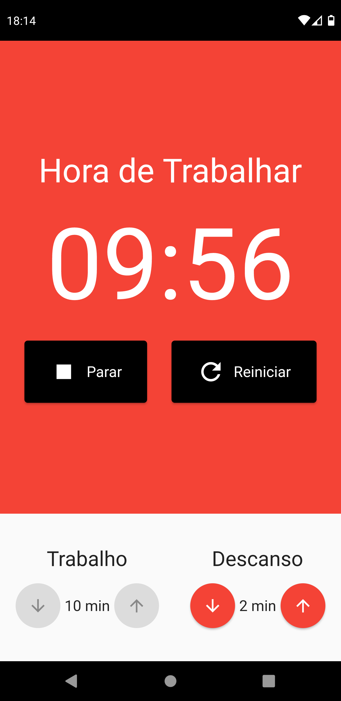
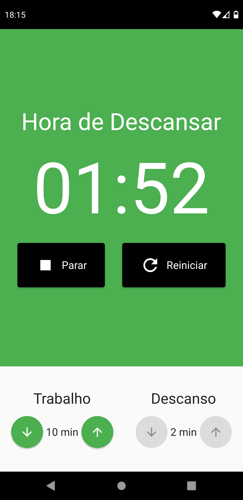

# Pomodoro Timer

# Sobre o Projeto
Pomodoro Timer é um aplicativo usado para gerenciar o tempo de trabalho e o tempo de descanso, dividindo-os em pequenos intervalos, onde se trabalha por um tempo e se descansa por outro.

# Objetivo
O objetivo do desenvolvimento deste projeto é fazer o gerenciamento de estados da aplicação utilizando o MobX.

# Layout

 

# Como Utilizar?

~~~
- Clonar o repositório:
$ git clone https://github.com/murilobohlke/pomodoro-timer.git

- Entrar no diretório:
$ cd pomodoro-timer/pomodoro_timer

- Instalar as dependências:
$ flutter pub get

- Iniciar o app: 
$ flutter run
~~~

# Tecnologias Utilizadas
- Flutter
- Provider
- MobX
- 
# Autor
Murilo Steinmetz Böhlke

